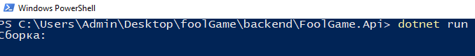
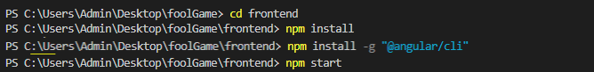
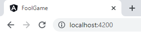

# foolGame

## Скачивание и установка.  Скачиваем <a href="https://dotnet.microsoft.com/en-us/download/visual-studio-sdks">.NET SDKs for Visual Studio</a>  Скачиваем <a href="https://nodejs.org">node.js</a>    

## Запуска backend. В папке foolGame\backend\FoolGame.Api  Открываем Windows PowerShell  И запускаем: dotnet run
    

## Запуск frontend. Создаём терминал и вписывем по очереди.  cd frontend  npm install  Возможно нужно ( npm install -g "@angular/cli" )  npm start
    

## Если всё удачно запущено, то заходим в браузер:
